# Centro de Convenciones - Sistema de Gestión

## Descripción

Este proyecto implementa un sistema de gestión para un Centro de Convenciones utilizando los principios de la Programación Orientada a Objetos (POO) y varios patrones de diseño. Proporciona funcionalidades para gestionar espacios, reservas, productos y aspectos económicos del centro.

## Autores
- Fabio Rodríguez Gómez
- Alfredo Sobrados González

## Características principales

- Gestión de espacios (alta, disponibilidad, y equipamientos).
- Gestión de reservas (creación, asignación de consumiciones, cancelación).
- Gestión de productos (creación de secciones y productos, disponibilidad).
- Gestión económica (cálculo de ingresos por espacio y generales).

## Patrones de diseño utilizados

### 1. Singleton
- **Clase aplicada:** `Centro_Convenciones`.
- **Descripción:** Asegura que exista solo una instancia del Centro de Convenciones.

### 2. Decorator
- **Clase aplicada:** `Espacio` y sus decoradores.
- **Descripción:** Permite agregar equipamientos opcionales (música, ornamentos, escenarios) a los espacios de manera dinámica.

### 3. Composite
- **Clases aplicadas:** `Carta`, `Sección`, y `Producto`.
- **Descripción:** Modela la jerarquía de la carta de productos para una gestión uniforme de componentes simples (productos) y compuestos (secciones).

### 4. Strategy
- **Clases aplicadas:** Clases de menús y submenús de gestión.
- **Descripción:** Permite manejar de forma dinámica los algoritmos de interacción en los menús.

## Estructura del proyecto

- **`Centro_Convenciones`**: Clase principal, gestiona las reservas, espacios y la carta de productos.
- **`Espacio`**: Representa un espacio del centro, que puede decorarse con opciones adicionales.
- **`Reserva`**: Administra la información de las reservas, incluyendo espacios y consumiciones.
- **`Carta`**: Administra la jerarquía de productos disponibles en el centro.
- **`Coste`**: Clase auxiliar que almacena precios específicos para años determinados.
- **`MenuPrincipal` y subclases**: Gestionan la interacción del usuario con las funcionalidades.

## Funcionalidades principales

### Gestión de espacios
1. Alta de nuevos espacios.
2. Modificación de disponibilidad de espacios.
3. Listado de espacios disponibles/no disponibles.

### Gestión de reservas
1. Alta de reservas.
2. Adición y eliminación de consumiciones.
3. Listado de reservas y consulta de una reserva específica.

### Gestión de productos
1. Alta de secciones y productos.
2. Modificación de disponibilidad de productos.
3. Consulta de la carta organizada.

### Gestión económica
1. Cálculo de ingresos por espacio.
2. Cálculo de ingresos totales del Centro de Convenciones.

## Casos de prueba

El proyecto incluye casos de prueba que verifican:
- Creación de espacios y reservas.
- Gestión de consumiciones y productos.
- Cálculos económicos.

## Diagrama de Clases

```mermaid
classDiagram
    class Centro_Convenciones {
        - instancia: Centro_Convenciones
        - listaEspacios: ArrayList<Espacio>
        - listaReservas: ArrayList<Reserva>
        - carta: Seccion
        + obtenerInstanciaCC(): Centro_Convenciones
        + buscarEspacio(cod: String): Espacio
        + altaEspacio(e: Espacio): boolean
        + listarInfoEspcDisponible()
        + calcularIngresosCC(fI: LocalDate, fF: LocalDate): double
    }

    class Espacio {
        - codigo: String
        - nombre: String
        - superficie: double
        - capacidad: int
        - listaCostes: ArrayList<Coste>
        - estado: boolean
        + getCodigo(): String
        + calcularIngreso(): double
    }

    class Reserva {
        - espacio: Espacio
        - fecha: LocalDate
        - cliente: String
        - telefono: long
        - listaConsumiciones: ArrayList<Consumicion>
        + getEspacioDecorado(): Espacio
        + aniadirConsumicion(consumicion: Consumicion)
        + mostrarConsumiciones()
    }

    class Carta {
        - nombre: String
        - id: String
        - descripcion: String
        + agregar(c: Carta)
        + mostrarInfo()
        + recuperarCarta(nombre: String): Carta
    }

    class Producto {
        - listaCostes: ArrayList<Coste>
        - estado: boolean
        + mostrarInfo()
        + buscarCoste(anio: int): Coste
    }

    class EquipamientoDecorador {
        - descripcion: String
        - espacio: Espacio
        + calcularIngreso(cod: String): double
    }

    class MenuPrincipal {
        - menus: ArrayList<Menus>
        + ejecutarOpciones(): String
    }

    class Menus {
        - centConv: Centro_Convenciones
        + getCentConv(): Centro_Convenciones
        + ejecutarOpciones(): String
    }

    class GestionEspacios {
        + darAltaEspacio()
        + generarCodigoEspacio(): String
        + ejecutarOpciones(): String
    }

    class GestionReservas {
        + darAltaReserva()
        + generarCodigoReserva(): String
        + ejecutarOpciones(): String
    }

    class GestionCartaProductos {
        + darAltaSeccion()
        + generarCodigoProducto(): String
        + ejecutarOpciones(): String
    }

    class GestionEconomica {
        + mostrarIngresosEspacio()
        + calcularIngresosCC(): double
        + ejecutarOpciones(): String
    }

    class Coste {
        - precio: double
        - anio: int
        + getPrecio(): double
    }

    class Consumicion {
        - producto: Producto
        - cantidad: int
        - id: String
        + calcularCosteConsumicion(): double
    }

    class Seccion {
        - listaProductos: ArrayList<Carta>
        + agregar(c: Carta)
        + mostrarInfo()
    }

    Centro_Convenciones --> Espacio : "1 .. * tiene o puede tener"
    Centro_Convenciones --> Reserva : "0 .. * tiene varias"
    Centro_Convenciones --> Carta : "0 .. 1 tiene"
    Reserva --> Consumicion : "0 .. * puede tener varias"
    EquipamientoDecorador --> Espacio : "0 .. 1 puede decorar"
    MenuPrincipal --> Menus : "1 provee de funcionalidades"
    Menus --> GestionEspacios : "1 0 .. *"
    Menus --> GestionReservas : "1 0 .. *"
    Menus --> GestionCartaProductos : "1 0 .. *"
    Menus --> GestionEconomica : "1 0 .. *"
    Carta <|-- Producto : "1 0 .. *"
    Carta <|-- Seccion : "1 0 .. *"
    Espacio --> Coste : "0 .. * tiene un historial de precios"
```



## Instalación

1. Clona este repositorio:
   ```bash
   git clone https://github.com/tu_usuario/centro-convenciones.git
   ```
2. Compila el proyecto:
    ```bash
   javac -d bin src/*.java
   ```
3. Ejecuta el programa:
   ```bash
   java -cp bin Main
   ```
## Agradecimientos
Agradezco a mis profesores y compañeros por su apoyo y orientación durante el desarrollo de esta práctica. Sus aportes han sido fundamentales para el éxito de este proyecto.
## Contribuciones
Si deseas contribuir a este proyecto, no dudes en hacer un fork del repositorio, proponer mejoras o reportar problemas. ¡Toda ayuda es bienvenida!
## Contacto
Para cualquier consulta o comentario sobre este proyecto, puedes contactarme a través de mi perfil de GitHub.
